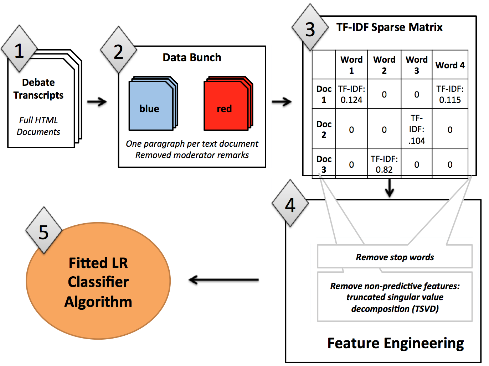

# About

### Purpose

This small web application is intended to highlight how to operationalize machine learning models in a web application. Through the lens of a political classifier we see how models can be managed and stored inside of Django for per-user and global modeling.

**Why this topic?** Political partisanship has been one of the defining characteristics of the 2016 U.S. Presidential race. This application models political partisanship generally, and then it allows users to provide feedback to the model

#### 1. Establishing the Initial Model

We've used the 2016 Presidential Primary debate transcripts to train machine learning models to classify text into one of two buckets: Republican or Democratic. The pipeline parses and vectorizes the text from the transcripts, removes non-predictive portions (such as moderator comments and candidate names), and assigns a term frequency-inverse document frequency (TF-IDF) value to each word in the transcripts. We then fit and cross-validated a logistic regression model using 12 folds; it classified transcript text as Republican or Democratic with 89% accuracy.

Here's a graphic depicting how we fit and trained our model:

#### 2. Operationalizing Machine Learning

Machine learning models become much more valuable when users can tweak individualized models. Here, we use the [Django web application framework](http://www.djangoproject.com) to allow users their own models. Django is a fast, secure, and scalable interface that allows an administrator

This project has been designed as a template for future interactive machine learning projects. Combining machine learning with a web application framework has limitless applications. Here are a couple of ways that this design could be used for future projects:

* Any type of recommender website (a la Amazon or Netflix) with many users
* Any type of targeted advertising within a specific website that has some way to track users

For more information on our design, see the [Partisan Discourse Architecture](/architecture.md).
